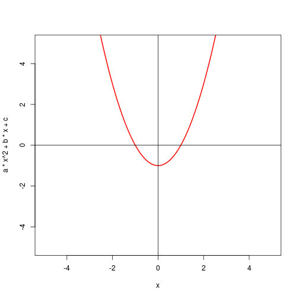

Solving with the Quadratic Equation
========================================================
author: Steve Nay
date: 27 January 2016

Parabolas
========================================================
Parabolas are defined by the formula

$y=a*x^2+b*x+c$

Parabolas have at most two roots, which are where the curve intersects with the x-axis.
For example, $x^2-1$ crosses the x-axis at -1 and 1. In this case, this is easy to see if
we factor the expression into $(x+1)(x-1)$.

But there's an algorithmic solution.


The Quadratic Formula
========================================================
The Quadratic Formula is

$\frac{-b \pm \sqrt{b^2 - 4ac}}{2a}$

We can represent that in R as follows:


```r
a <- 1
b <- 0
c <- -1

(-b + c(-1,1) * sqrt(b^2-4*a*c))/2*a
```

```
[1] -1  1
```

The Shiny application
========================================================
The Shiny application allows you to explore the relationship between a, b, and c.

It graphs the formula described by the coefficients you entered, and then it solves
for the roots using the quadratic formula.

Give it a try
========================================================
Have a try at https://snay2.shinyapps.io/quadratic/


```r
curve(a*x^2 + b*x + c, from=-5, to=5, ylim=c(-5,5), col='red', lwd=2)
abline(h=0)
abline(v=0)
```

 
